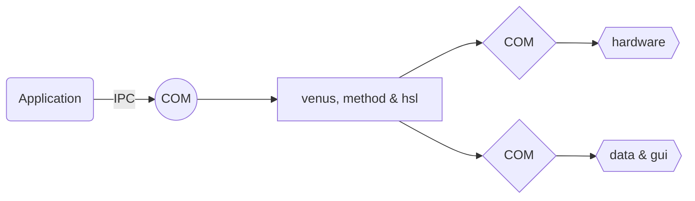

# Why did we developed SharpHamilton?

##  Control Hamilton STAR line in Application

For Hamilton STAR was controlled with methods in Venus software, if we want to control STAR in our application, we have to do as following schema



* Write a COM and HSL file to embed COM, application can communicate with method by inter process communication to COM
* We have to write more COM and hsl file to enable method more functions, like device controlling, data analysis and GUI

## What did we do

We have about 60 method files like below, which were quite difficult to develop and maintain for Venus software has no OOP, complex data structure, intellisense, unit test, version control and so on. And also we wrote many COMs and related hls files. 


The structure of application is very complex with  many COMs and inter process communications, which decrease the performance of application. To add a new device, we have to write code for COM and hsl to embed COM, and also we have to write more methods and codes to control it in Venus and communicate between application and Venus. There are also other works like COM registering. The programmer should have many legacy skills and knowledges.

## What is our plan

To solve these problems, we began to develop project of controlling STAR line with C# code directly like below. With this project, we can simplify the application by removing all the COM/method/hsl, and enhance the performance by removing all inter process communication. There is only C# left, and development and maintenance of application can done by C# programmer alone.

```mermaid
graph LR
A(Application)  --> B{{Hamilton STAR}} 
A --->  C{{hardware}}